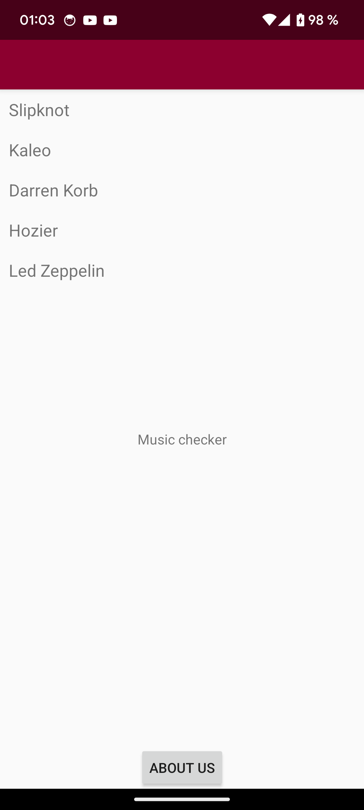

# Rapport

Jag började med att lägga till den JSON data jag skulle använda för min RecyclerView. Kodexempel för JSON data finns nedan.
Sedan ändrade jag namnet på appen samt färgschemat. Efter det skapade jag en andra aktivitet och även knappar för att byta emellan dem (Home/about us).
Därefter skapades layouten till recyclerview, adaptern och widgeten. Sedan initialiserades recyclerviewn:n. Slutligen justerade jag placeringarna något och lade till text för "about us".

```
[
  {
    "ID": "projekt_slipknot",
    "LOGIN": "slipknot",
    "name": "Slipknot",
    "members": "Corey Taylor, Shawn Crahan, et al",
    "genre": "Metal",
    "active": "1999-present"
  },

  {
    "ID": "projekt_Kaleo",
    "LOGIN": "kaleo",
    "name": "Kaleo",
    "members": "Jökull Júlíusson, Davíð Antonsson et al",
    "genre": "Blues rock",
    "active": "2012-present"
  },

  {
    "ID": "projekt_korb",
    "LOGIN": "darren_korb",
    "name": "Darren Korb",
    "members": "Darren Korb",
    "genre": "Game soundtracks",
    "active": "2011-present"
  },

  {
    "ID": "projekt_hozier",
    "LOGIN": "hozier",
    "name": "Hozier",
    "members": "Andrew John Hozier-Byrne",
    "genre": "Blues rock",
    "active": "2008-present"
  },

  {
    "ID": "projekt_zeppelin",
    "LOGIN": "led_zeppelin",
    "name": "Led Zeppelin",
    "members": "Robert Plant, Jimmy Page, et al",
    "genre": "Folk rock",
    "active": "1968-1980"
  }
]
```



L